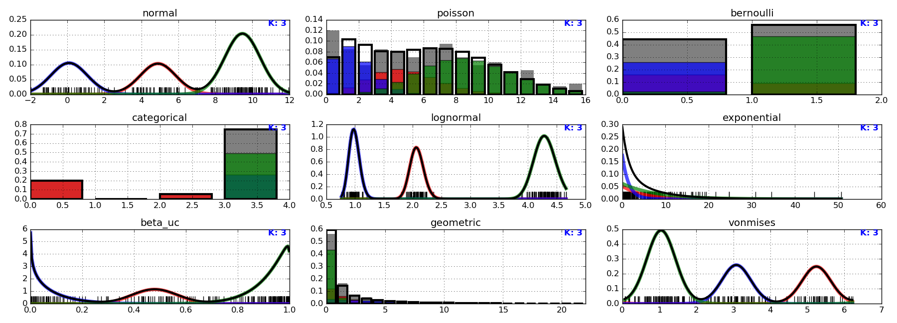
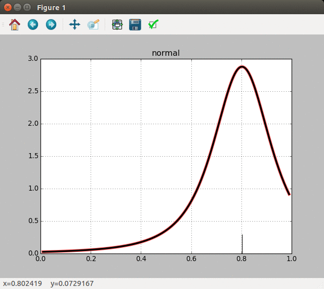

# cgpm

The aim of this project is to provide a unified probabilistic programming
framework to express different models and techniques from statistics, machine
learning and non-parametric Bayes.

Conditional generative population models (CGPM) provide a computational
abstraction for probabilistic objects. They provide an interface that explicitly
differentiates between the _sampler_ of a random variable from its conditional
distribution and the _assessor_ of its conditional density. By encapsulating
models as probabilistic programs that implement CGPMs, complex models can be
built as compositions of sub-CGPMs.

## Installing
```
pip install .
```

## Static Example

The simplest example is creating a synthetic dataset where each variable is a
mixture of one of the available DistributionGpms. Inference is run using
[gpmcc](src/crosscat), an extended implementation of
[crosscat](http://probcomp.csail.mit.edu/crosscat/) from the lens of
compositions of conditional generative population models.

```
$ python -i tests/graphical/one_view.py
```

A plot similar to  should appear.

## Interactive Example (Experimental)

Single-particle SMC in a DP Mixture with Normal-InverseGamma base measure and
normal obervations can be run interactively:

```
$ python -i tests/graphical/dpmm_nignormal.py
```

Click on the graph to produce observations and watch, the Gibbs kernel cycle
through the hypothesis space



The values printed in the console after each click are estimates of the
marginal-log-likelihood of observations, based on the single particle
weight. The following output

```
Observation 8.000000: 0.209677
[-8.0740236375201153]
```

means the eighth observation is 0.209677, and the estimated marginal
log-liklelihood is -8.0740236375201153.

## Tests

Running `./check.sh` will run a subset of the tests that are considered complete
and stable. To launch the full test suite, including continuous integration
tests, run `py.test` in the root directory. There are more tests in the `tests/`
directory, but those that do not start with `test_` or do start with `disabled_`
are not considered ready. The tip of every branch merged into master __must__
pass `./check.sh`, and be consistent with the code conventions outlined in
[HACKING](HACKING).

## License

Copyright (c) 2015-2016 MIT Probabilistic Computing Project

Licensed under the Apache License, Version 2.0 (the "License");
you may not use this file except in compliance with the License.
You may obtain a copy of the License at

   http://www.apache.org/licenses/LICENSE-2.0

Unless required by applicable law or agreed to in writing, software
distributed under the License is distributed on an "AS IS" BASIS,
WITHOUT WARRANTIES OR CONDITIONS OF ANY KIND, either express or implied.
See the License for the specific language governing permissions and
limitations under the License.
